# Лабораторная работа №6
# Цель лабораторной работы
Изучение базовых возможностей системы управления версиями, опыт работы с Git Api, опыт работы с локальным и удаленным репозиторием.

# Ход работы
Сначала необходимо было сделать форк репозитория на ноутбук:

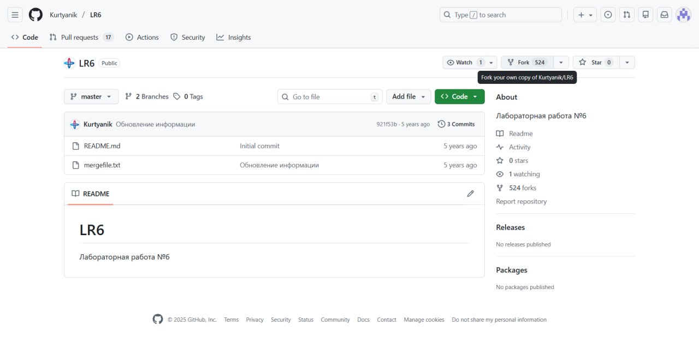
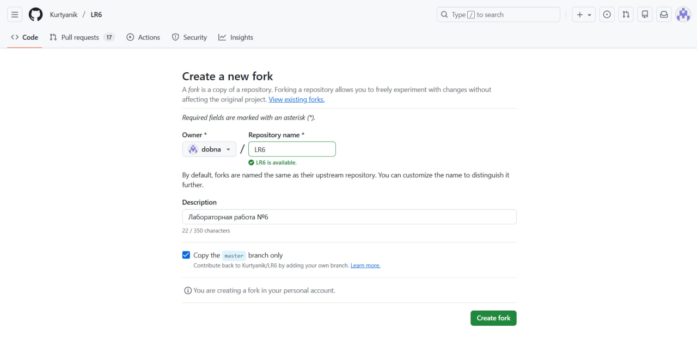
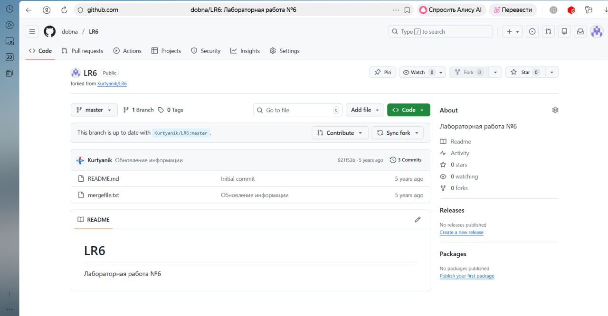

Сделали копию и настроили клиент git:

Создали файл через интерфейс github и пдгрузили изменения в локальный репозиторий:

Посмотрели историю операций и последние изменения:

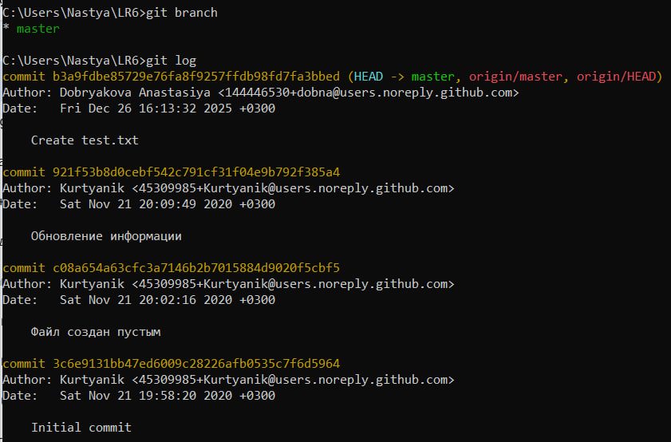
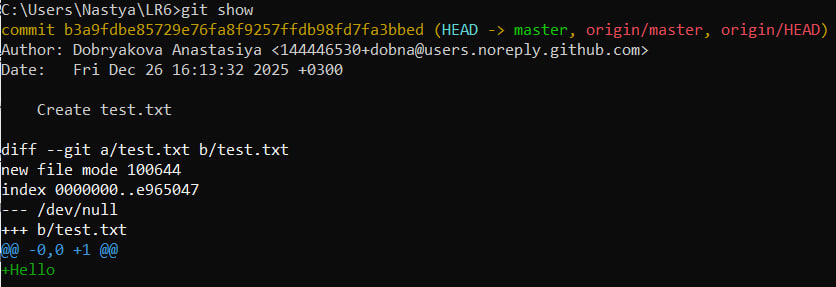

Создали ветку и изменили файл в ней и в мастере, чтобы создать конфликт:

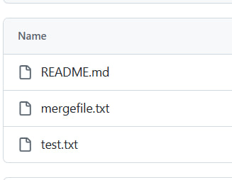

Попытка слияния веток для вызова конфликта:

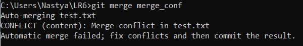
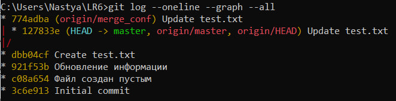

Открываем файл в текстовом редакторе и меняем его:

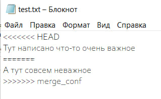

Пробуем слить ветки теперь:

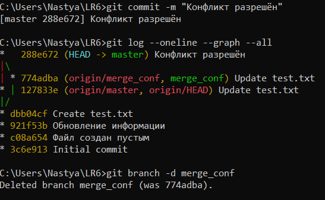

Удаляем побочную ветку:

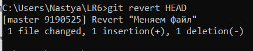

Делаем дополнительные изменения и сохраняем их:

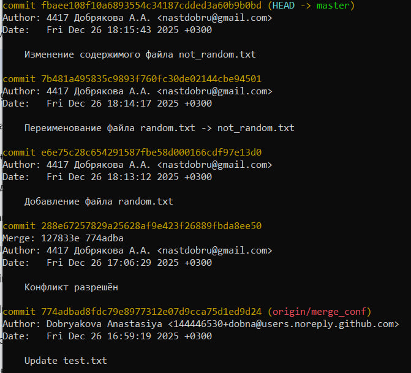

