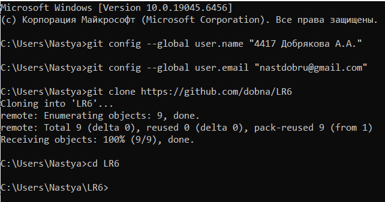
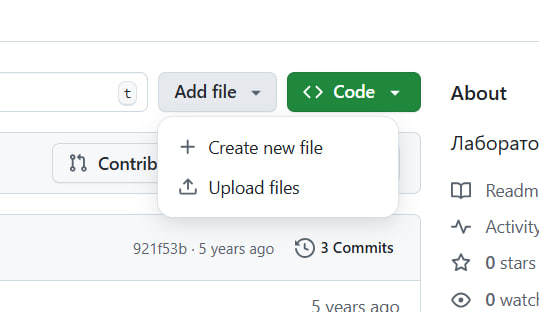
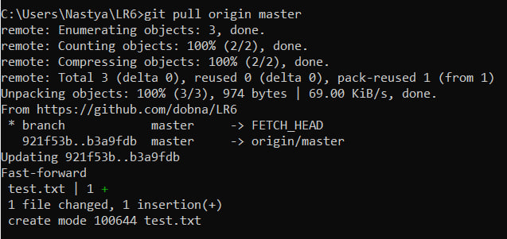
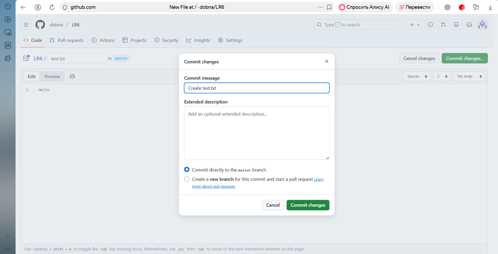

# Лабораторная работа №6
# Цель лабораторной работы
Изучение базовых возможностей системы управления версиями, опыт работы с Git Api, опыт работы с локальным и удаленным репозиторием.

# Ход работы
Сначала необходимо было сделать форк репозитория на ноутбук:

Сделали копию и настроили клиент git:

Создали файл через интерфейс github и пдгрузили изменения в локальный репозиторий:

Посмотрели историю операций и последние изменения:

Создали ветку и изменили файл в ней и в мастере, чтобы создать конфликт:

